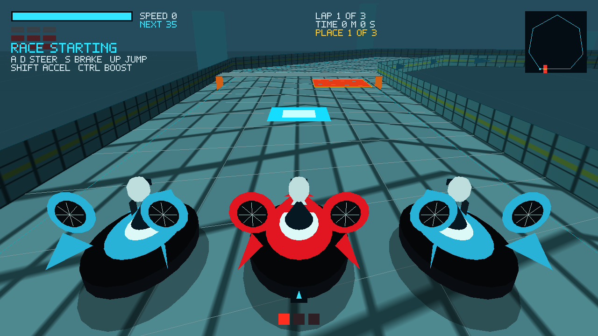

# OpenHover

A hovercraft racing game, written from scratch and free of the HoverRace licence.

**Status: playable alpha.** OpenHover has complete local and authoritative online races across
three original tracks. It has no history from, and contains no code or assets copied from, the
licensed HoverNet / HoverRace project (kept separately as "HoverNet Classic").

## Ground rules

- Nothing is added unless its origin and licence are known and recorded.
- Code, textures, models and sounds are created new, or come from sources whose
  licences are written down in the provenance ledger.
- No licensed HoverRace source or asset is copied in, and the licensed project's code
  is not consulted while writing replacements.

## What is here

The project includes SHA-256 and gzip utilities, wire-format helpers, a track catalogue, and a
verified downloader, each with tests. The original 3D SDL2/OpenGL game supports craft classes,
AI rivals, championships, weapons, replays, gamepads, driving assists, procedural audio, and
authoritative online races with a public-room lobby. Build and test with:



```
cmake -S . -B build && cmake --build build && ctest --test-dir build
```

Run `./build/OpenHover` to drive the arena. Select **Play Local Game** from the main menu, choose
the original track, lap count, and weapons setting, then select **Start Race**. A three-light
countdown begins before the race. Use `W`/`S` or Shift/Down to accelerate and reverse, `A`/`D` or
Left/Right to steer, Up to jump, Ctrl to fire a missile when weapons are allowed, `X` to recover
after leaving the road, and Escape to pause. Pause and choose **Key Bindings** to remap accelerate, brake, steering, fire, and recover; bindings are saved next to the setup file and arrow keys and Shift always remain available.
Missiles retain their firing height, bounce off course walls, and spin out any craft they hit,
including the player. A connected gamepad uses its left stick to steer, triggers to accelerate and
brake, B to jump, X to fire, and Y to recover after leaving the road (remappable under Key Bindings in the pause menu). On a gamepad, Start pauses, and the D-pad, A and B navigate menus, the pause menu and results.
Pass checkpoints in order, then cross the finish zone to complete a
lap. Complete the selected number of laps to finish; press `R` to restart. The rivals follow the
same course; the first craft to finish wins. Procedural audio cues confirm menu actions, impacts,
and checkpoints when an audio device is available; toggle them in **Settings**.

## Process

- [Clean-room policy](docs/clean-room-policy.md): what may and may not go in.
- [Release notes](docs/release-notes.md): player-facing changes and known limitations.
- [Roadmap](docs/roadmap.md): staged plan for the playable game and its original feature set.
- [Track format](docs/track-format.md): v1 route and provenance requirements.
- [Licensing](docs/licensing.md) and [third-party notices](THIRD_PARTY_NOTICES.md).
- [Provenance ledger](PROVENANCE.md): where every file came from. Run
  `scripts/check-provenance.py` before committing.

## Licence

Code and documentation are licensed under either the [MIT License](LICENSE-MIT) or the
[Apache License 2.0](LICENSE-APACHE), at your option (`MIT OR Apache-2.0`). Created game
assets are CC BY 4.0 (or CC0 where stated). Details, and which dependencies are acceptable:
[licensing](docs/licensing.md). Contributions are accepted under the same terms.
