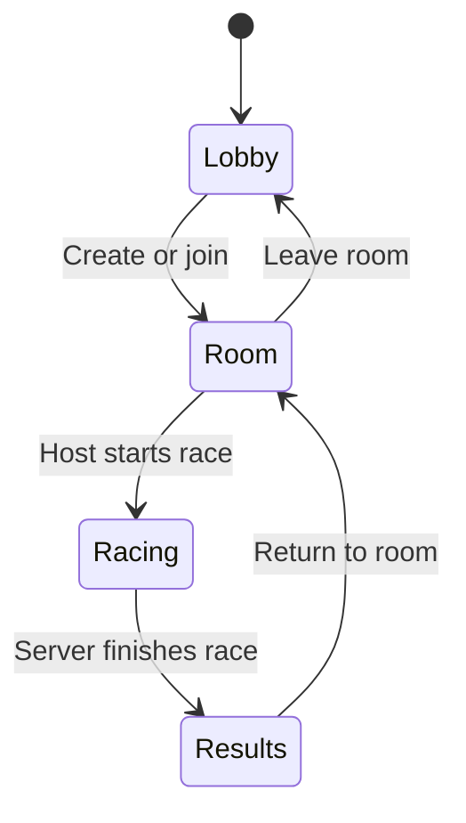

# Multiplayer Design

## Scope

OpenHover multiplayer uses a central, authoritative server. A player who creates a
room is its host, but does not run the race simulation. The host selects the race
settings and starts the race; the central server validates inputs, advances the
simulation, and publishes race state to every client.

The initial release uses a player-supplied display name. Rooms are public and are
listed in the shared lobby.

## Lobby

After connecting, a player enters the lobby and can:

- see connected players and open rooms;
- send lobby chat messages;
- create a room;
- join an open room; and
- return to the lobby when leaving a room or completing a race.

Room chat remains available before and after a race. The server assigns player
identifiers and owns display-name validation, room membership, chat history, and
host privileges. It rate-limits chat, bounds message sizes, and disconnects peers
that exceed protocol limits.

## Room Lifecycle

Creating a room makes its creator the host. The host may set:

- race mode;
- track;
- lap count;
- player capacity;
- rival count and difficulty;
- weapons setting; and
- room name.

Only the host can change settings or start the race. Settings lock while racing.
If the host disconnects before a race, the server elects the oldest remaining room
member as host. If the room becomes empty, the server removes it.

## Networking Model

The initial implementation uses one reliable, encrypted TCP connection from each
client to the server. Clients make an outbound connection to `outiva.com:9700`,
so they work across separate NATs without accepting inbound connections or using
UDP. The connection carries login, lobby/room changes, chat, ready states, race
settings, input commands, state snapshots, and results.

Clients send timestamped input commands, never positions or race progress. The
server runs the existing fixed-step hovercraft, collision, checkpoint, missile,
and race logic. It publishes snapshots at a fixed cadence and clients interpolate
remote racers between them. This prevents clients from deciding their own lap,
weapon, or collision outcomes. Snapshot messages are small and supersede older
snapshots still queued on the client, which limits the impact of TCP head-of-line
blocking for the first release.

The first protocol version needs explicit message types for hello, lobby snapshot,
chat, room create/update/join/leave, race start, input, state snapshot, result,
and error. Every message has a protocol version, bounded payload size, and a
server-issued connection and room identifier.

## Server Process

`OpenHoverServer` will be a headless executable separate from the SDL/OpenGL
client. It links to `openhover_game` so the server and client use the same race
rules. It owns lobby state and runs one fixed-step race instance per active room.
It listens on TCP port `9700` for all client traffic.

The initial executable implements the lobby protocol only. Run it with
`./build/OpenHoverServer`; `./build/OpenHoverServer --port 9700` is equivalent.
It accepts `HELLO`, `CHAT`, `CREATE`, `JOIN`, `LEAVE`, `SET`, and `START` commands
over a line-based TCP protocol. This prototype is unencrypted and is for local
development only; it must not be exposed to the public internet before the
encrypted transport is implemented.

The first implementation stages are:

1. Add protocol value types and pure lobby/room state with smoke tests.
2. Add the headless server executable with reliable lobby/chat/room commands.
3. Add the client lobby screens and room settings UI.
4. Add authoritative race input/snapshots and client interpolation.
5. Add reconnect handling, load limits, telemetry, and a public deployment runbook.

## Public Deployment

The target machine is `192.168.10.181`. SSH is only the administration path; it
does not make the server reachable to players. A public deployment also requires:

- a non-root service account and a systemd unit for `OpenHoverServer`;
- a firewall rule for TCP port `9700`;
- router/NAT forwarding if the address is behind a private network;
- TLS for the control connection and authenticated encryption for game traffic,
  or an encrypted network overlay such as WireGuard during early testing;
- log rotation, restart-on-failure, and a server version/protocol compatibility
  policy.

Do not expose a display-name-only, plaintext lobby directly to the public internet.
The first executable can be developed and tested on the LAN, but public launch
must include transport encryption and an abuse-control policy.

## Continuous Deployment

GitLab CI uses the `race-server` runner tag, builds and tests the server, and stores
an `openhover-raceserver` Debian package in `dist/` as a pipeline artifact. A tag
pipeline exposes the manual production `deploy_race_server` job. Deployment calls
the server-side `/usr/local/sbin/openhover-deploy` wrapper, which validates that
the artifact is an OpenHover package within the GitLab build directory before
installing it as `openhover-raceserver.service`. The service listens on TCP port
`9700`.