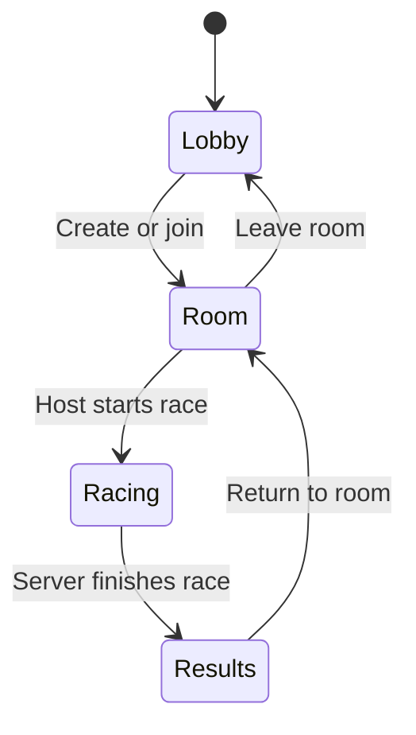

# Multiplayer Design

## Scope

OpenHover multiplayer uses a central, authoritative server. A player who creates a
room is its host, but does not run the race simulation. The host selects the race
settings and starts the race; the central server validates inputs, advances the
simulation, and publishes race state to every client.

The initial release uses a player-supplied display name. Rooms are public and are
listed in the shared lobby.

## Lobby

After connecting, a player enters the lobby and can:

- see connected players and open rooms;
- send lobby chat messages;
- create a room;
- join an open room; and
- return to the lobby when leaving a room or completing a race.

Room chat remains available before and after a race. The server assigns player
identifiers and owns display-name validation, room membership, chat history, and
host privileges. It rate-limits chat, bounds message sizes, and disconnects peers
that exceed protocol limits.

Chat is limited per connection to four accepted messages in any two-second window. A rejected
message is not added to history or broadcast, and the sender receives a visible slow-mode status.
Players can hide another player's lobby and in-race chat for the current connection with
`/MUTE display-name`, and restore it with `/UNMUTE display-name`. Server notices cannot be muted.
`/REPORT display-name reason` sends a bounded moderation report to the server and confirms receipt.
Reports are limited to two per connection per minute, are written to the server's operational log
for human review, and do not trigger an automatic penalty. The report contains the two server-issued
player IDs and the reason supplied by the reporter; operators control retention through log rotation.

The server accepts at most 64 simultaneous TCP connections and disconnects a peer whose unprocessed
receive buffer exceeds 4 KiB. Connection opens, capacity rejections, disconnect reasons, player IDs,
and room IDs are emitted as structured single-line operational events. Oversized-peer removal is
isolated: other lobby and race connections remain active.

## Room Lifecycle

Creating a room makes its creator the host. The host may set:

- race mode;
- track;
- lap count;
- player capacity;
- rival count and difficulty;
- weapons setting; and
- room name.

Only the host can change settings or start the race. Settings lock while racing.
If the host disconnects before a race, the server elects the oldest remaining room
member as host. If the room becomes empty, the server removes it.

## Networking Model

The initial implementation uses one reliable, encrypted TCP connection from each
client to the server. Clients make an outbound connection to `outiva.com:9700`,
so they work across separate NATs without accepting inbound connections or using
UDP. The connection carries login, lobby/room changes, chat, ready states, race
settings, input commands, state snapshots, and results.

Clients send timestamped input commands, never positions or race progress. The
server runs the existing fixed-step hovercraft, collision, checkpoint, missile,
and race logic. It publishes snapshots at a fixed cadence and clients interpolate
remote racers between them. This prevents clients from deciding their own lap,
weapon, or collision outcomes. Snapshot messages are small and supersede older
snapshots still queued on the client, which limits the impact of TCP head-of-line
blocking for the first release.

The protocol has explicit message types for hello, lobby snapshot, chat, moderation,
room create/update/join/leave, race start, input, state snapshot, result, and error.
Every connection negotiates a protocol version and built-in content version, uses bounded
payloads, and receives server-issued player and room identifiers.

## Server Process

`OpenHoverServer` will be a headless executable separate from the SDL/OpenGL
client. It links to `openhover_game` so the server and client use the same race
rules. It owns lobby state and runs one fixed-step race instance per active room.
It listens on TCP port `9700` for all client traffic.

Run the dedicated lobby and authoritative race server with
`./build/OpenHoverServer`; `./build/OpenHoverServer --port 9700` is equivalent.
`./build/OpenHoverServer --version` prints the package, source revision, protocol version,
and built-in content version for deployment checks. The line-based TCP transport is unencrypted
and is for local development only; it must not be exposed to the public internet before encrypted
transport is implemented.

The server greeting advertises protocol and built-in content versions. A client replies with
`HELLO <protocol>|<content>|<display-name>`; incompatible clients are rejected before entering
the lobby and receive an update-required error that the client presents as an actionable status.
Display names are validated by the server, not just the game UI: they must contain 1-24 ASCII
letters, digits, underscores, or hyphens. Duplicate names are also rejected.
After connection, the lobby keeps the advertised server package, protocol, and content versions
visible beside connection status so players and support staff can identify the endpoint in use.

## Compatibility Policy

The current compatibility tuple is protocol `5`, built-in content `2`. A client may enter the
lobby only when both values exactly match the server; this release does not attempt mixed-version
simulation or silently downgrade features.

- Increment the protocol version for any incompatible wire-format, message-semantic, authority,
  timing, or validation change. Additive messages also require an increment until capability
  negotiation exists.
- Increment the built-in content version whenever bundled track geometry, checkpoints, hazards,
  spawn positions, or other race-affecting content changes. Cosmetic-only changes do not require it.
- Package-version changes alone do not make clients incompatible. Operators must compare the
  advertised protocol/content tuple during deployment and must update server and clients together
  when either value changes.
- Only the current tuple is supported. A rejected client receives a distinct protocol or content
  update message; the previous tuple has no compatibility grace period while the project is alpha.
- Every tuple change must update the shared constants, the `ServerVersionSmoke` expectation,
  integration coverage, release notes, and this section in the same change.

If a racer disconnects during an authoritative race, the server aborts that race, keeps the
remaining room and migrated host intact, and sends `RACEABORT` to return the other players to the
lobby with a visible reason.

If the server connection itself closes, the client clears stale room/race state and returns an
active racer to the multiplayer screen. If the session had been established, the client then
reconnects automatically with delays of 1, 2, 4, 8, and 15 seconds, showing a countdown and attempt
number in the lobby status; a successful lobby snapshot resets the count. After the fifth failed
attempt, or when the server was never reachable, it shows explicit back-and-retry guidance. A
reconnect starts a new lobby session: the player is not returned to the room or the aborted race.

Hosts can choose a public listed room or a private room during setup. A private room is omitted
from non-members' lobby snapshots and receives a six-character invitation code shown to its host.
Another player joins by entering `/JOIN code` in lobby chat. Codes use unambiguous uppercase letters
and digits, remain valid for that room's lifetime, and are invitations rather than account security.

Room details show the authoritative ready count. The host is ready by definition; each guest uses the
visible `READY` / `CANCEL READY` room button. Keyboard players can press Tab to leave chat focus and
Enter to activate the primary action; controller players use the D-pad and A. `/READY` remains an
optional chat shortcut. The server rejects `START` until every current room member is ready, resets
departing players' state, and automatically marks a migrated host ready.

The presence list labels players as `LOBBY`, `HOST`, `READY`, or `NOT READY` from authoritative
snapshot state. Membership metadata for a private room is visible only to that room's members;
other lobby users continue to see those players without private-room details.

The first implementation stages are:

1. Add protocol value types and pure lobby/room state with smoke tests.
2. Add the headless server executable with reliable lobby/chat/room commands.
3. Add the client lobby screens and room settings UI.
4. Add authoritative race input/snapshots and client interpolation.
5. Add reconnect handling, load limits, telemetry, and a public deployment runbook.

## Public Deployment

The target machine is `192.168.10.181`. SSH is only the administration path; it
does not make the server reachable to players. A public deployment also requires:

- a non-root service account and a systemd unit for `OpenHoverServer`;
- a firewall rule for TCP port `9700`;
- router/NAT forwarding if the address is behind a private network;
- TLS for the control connection and authenticated encryption for game traffic,
  or an encrypted network overlay such as WireGuard during early testing;
- log rotation, restart-on-failure, and a server version/protocol compatibility
  policy.

Do not expose a display-name-only, plaintext lobby directly to the public internet.
The first executable can be developed and tested on the LAN, but public launch
must include transport encryption and an abuse-control policy.

## Continuous Deployment

GitLab CI uses the `race-server` runner tag, builds and tests the server, and stores
an `openhover-raceserver` Debian package in `dist/` as a pipeline artifact. A tag
pipeline exposes the manual production `deploy_race_server` job. Deployment calls
the server-side `/usr/local/sbin/openhover-deploy` wrapper, which validates that
the artifact is an OpenHover package within the GitLab build directory before
installing it as `openhover-raceserver.service`. The service listens on TCP port
`9700`.
